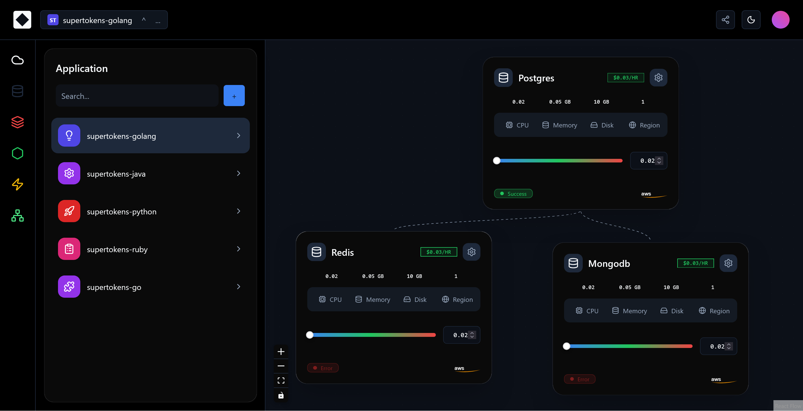

# 🚀 App Graph Builder



A modern, responsive Application Graph Builder built to visualize and configure microservice architectures. This project demonstrates complex state management, custom node rendering, and mocked API data fetching seamlessly integrated into an interactive canvas.

---

## 🛠️ Tech Stack

- **Framework**: React 18 + Vite
- **Language**: TypeScript (Strict Mode)
- **Canvas / Graph**: ReactFlow (xyflow)
- **State Management**: Zustand
- **Data Fetching**: TanStack Query (React Query)
- **Mocking**: MSW (Mock Service Worker)
- **Styling**: Tailwind CSS + Shadcn UI

---

## ✨ Key Features

### 1. Interactive Graph Canvas
- **Custom Service Nodes**: A highly customized, bespoke ReactFlow node (`ServiceNode`) that acts as a real-time inspector.
- **Embedded Controls**: Nodes feature native Shadcn tabs, responsive data grids, status badges, and a custom gradient slider that syncs live with the node's numeric input.
- **Standard Interactions**: Drag, pan, zoom, fit view, and delete nodes natively via ReactFlow controls.

### 2. Modern Responsive Layout
- **Strict Theme Adherence**: Exact color token mapping for a premium dark mode experience.
- **Theme Toggling**: Seamless light/dark mode switching utilizing CSS variables and Tailwind class strategies.
- **Mobile Drawer**: The application panel automatically converts into a slide-over `Sheet` (drawer) on smaller viewports, controlled globally via Zustand.

### 3. State & Data Layer
- **Zustand**: Minimal, un-opinionated global state managing selected nodes, active tabs, and responsive UI toggles without deep prop-drilling.
- **TanStack Query + MSW**: Simulated latency and network requests intercepted at the browser level, delivering fully cached and manageable loading/error states.

---

## ⚙️ Setup Instructions

1. **Clone the repository** and install dependencies:
   ```bash
   npm install
   ```

2. **Start the development server**:
   ```bash
   npm run dev
   ```

3. **Code Quality & Verification**:
   ```bash
   npm run typecheck   # Verifies strict TypeScript compliance
   npm run lint        # Runs ESLint checks
   npm run build       # Builds the production bundle
   ```

---

## 🏗️ Engineering Decisions

- **Node Inspector Architecture**: The initial requirements mentioned a "Right Panel Inspector", but the provided design specs strictly visualized the inspector UI (tabs, sliders, stats) embedded *directly* within the nodes on the canvas. To match the visual spec perfectly, the Inspector was built natively inside the custom `<ServiceNode />`.
- **CSS Variables & Theming**: Instead of relying on hardcoded hex colors that break across themes, specific styling requirements were abstracted into Tailwind CSS variables in `index.css`. This ensures the UI scales perfectly between Dark and Light mode without manually overriding utility classes everywhere.
- **Separation of Concerns**: The layout, canvas, and data-fetching hooks are strictly modularized. Global state is handled via Zustand, localized node state is managed by ReactFlow, and server state is managed exclusively by TanStack Query.

---

## 📝 Known Limitations

- **Mock Persistence**: Adjusting the node's slider updates the visual state successfully, but since the mock API is read-only, changes are not persisted if you switch to a different application and return.
- **Placeholder Branding**: Generic Lucide-React icons and generic colors were utilized in the application list as placeholders for custom branding assets.
